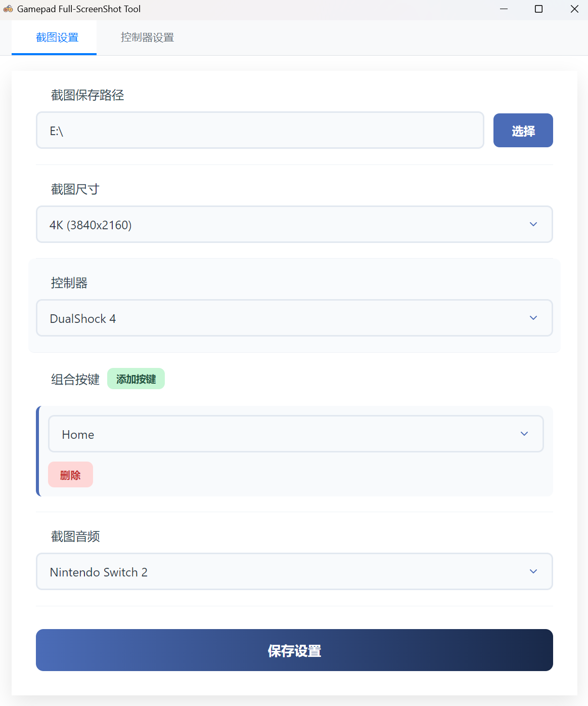
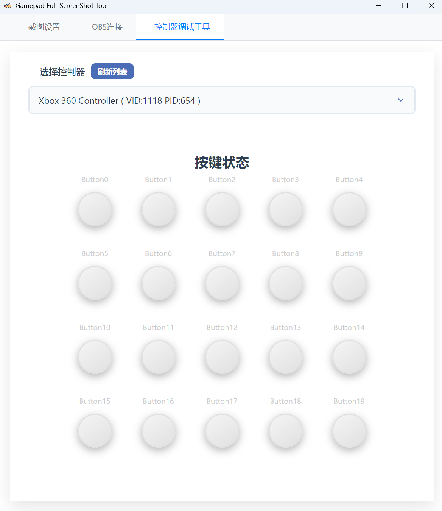
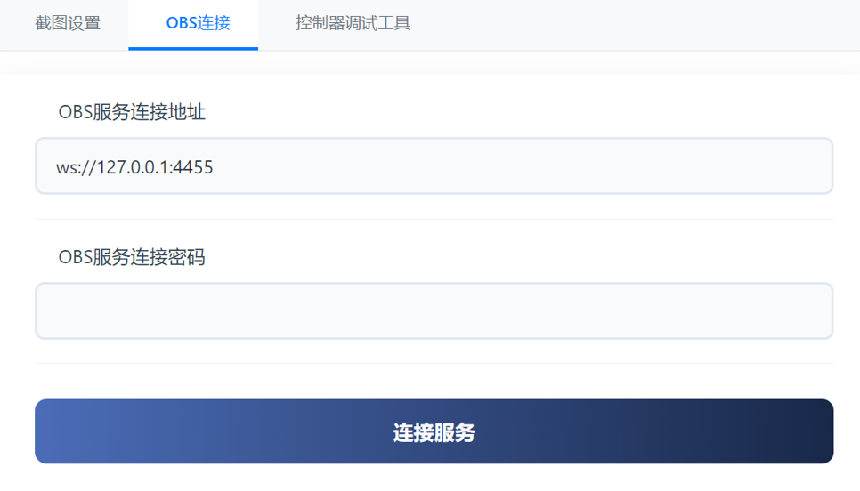
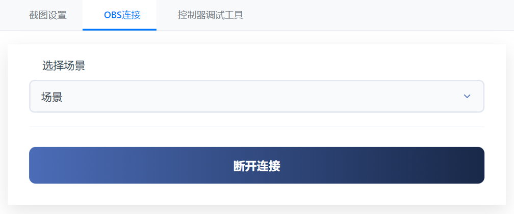

# 🎮 GamePad-ScreenShot

  

  <strong>使用手柄快捷键进行全屏截图的 Windows 工具</strong>

  
    
  

---

## 📖 简介

一个基于 **HID 输入** 的 Windows 工具，允许你使用**手柄快捷键**来触发**全屏截图** 或者 **OBS 截图** 。

- ✅ 支持组合键触发
- ✅ 支持自定义手柄与外设扩展
- ✅ 支持**OBS-Websocket**连接，使用**OBS场景**来截图
- ✅ 预置适配手柄：**DualShock 4 / 5**、**Pro Controller**、**Xbox**
---

## 🖼️ 软件界面

  

---

## 🎮 手柄按键映射

| 按键               | DualShock 4 / 5 | XBOX     | Pro Controller     |
| ------------------ | ----------- | ---------- |---------- |
| **Home**           | PS 按钮     | （未实现） | Home|
| **L1**  | L1          | LB         |L1|
| **R1** | R1          | RB         |R1|
| **Start**          | Share       | Select     |Minus|
| **Select**         | Option      | Start      |Plus|

---

## ⚙️ 如何扩展其他手柄

> ⚠️ 需要具备基础的 JSON 阅读与编辑能力

1. 打开 `程序目录/controllerConfig.json`文件
2. 在数组中新增一条记录（可复制已有一条进行修改）：
   - `deviceName`：界面显示名称
   - `vid` / `pid`：设备对应的 Vendor ID / Product ID
   - `buttons`：各按钮对应的 buffer 索引 与 bit 位索引
3. 启动程序，切换到 第二个 Tab 页，选择需要配置的控制器

  

4. 依次按下需要绑定的按钮
    - 观察数据变化（通常为 0 → 1）
    - 记录发生变化的 buffer 索引 与 bit 位
    - 将对应值填写回 `controllerConfig.json`
5. 完成后保存配置并重新加载即可生效 🎮

---
## ⚙️ 通过OBS截图
1. 在 OBS 软件中手动开启 **WebSocket 服务器**（通常在“工具”菜单下）。
2. 打开本软件的 **OBS 连接设置** 页面。
3. 准确填写 OBS 服务器的 **IP 地址**、**端口号**及**密码**。
4. 点击连接服务

  

5. 在下拉列表中选择你想要抓取的 **场景 (Scene)**

  

6. 返回软件的 **截图设置** 页面，将“截图方式”切换为 **OBS** 即可生效。

---
## 📋 开发计划 (TODO)

- [x] 增加对标准 XBOX、NS、DS5 手柄的支持
- [x] 降低自定义手柄的扩展难度
- [x] 对接OBS的Socket服务 从而使用OBS来截图
- [ ] 音频音量调整
- [ ] 支持可选的截图格式

---

## ⚠️ 已知局限性

**以下局限性 可以通过连接OBS截图解决**

- 使用不支持非 16:9 屏幕比例适配
- 多屏幕环境下无法选择特定屏幕截图
- 仅支持全屏截图，不支持窗口截图

---