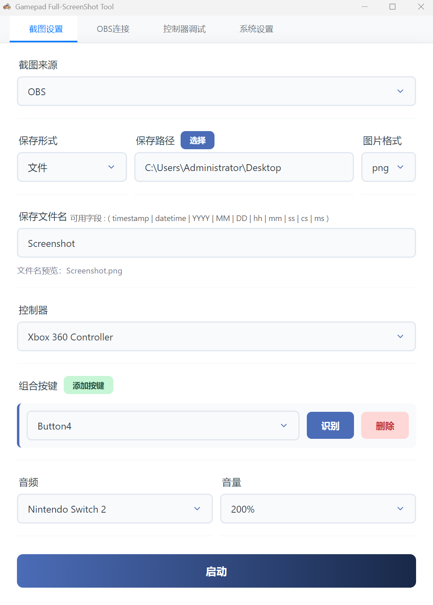
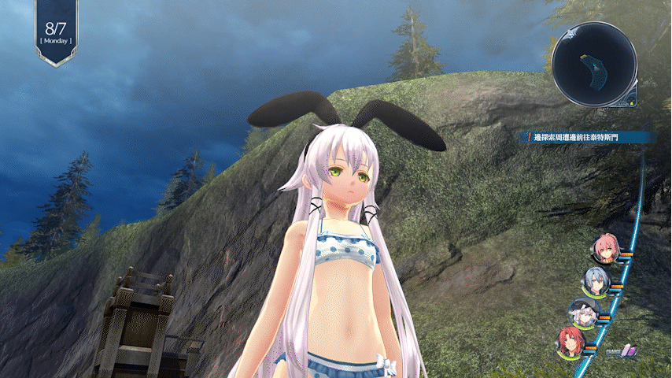
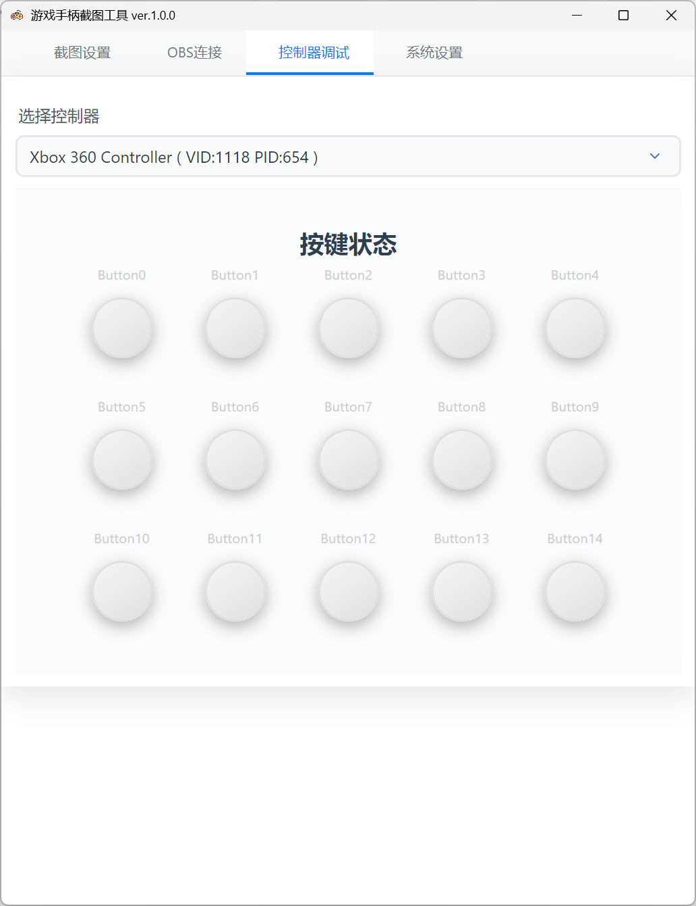
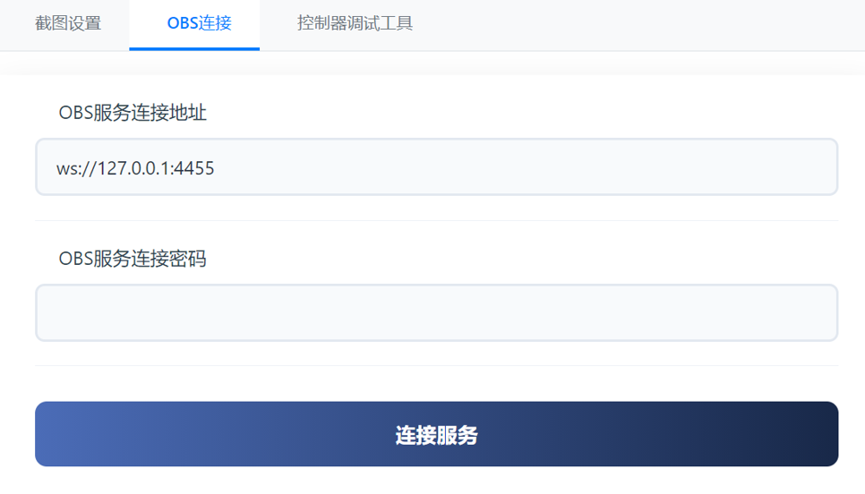
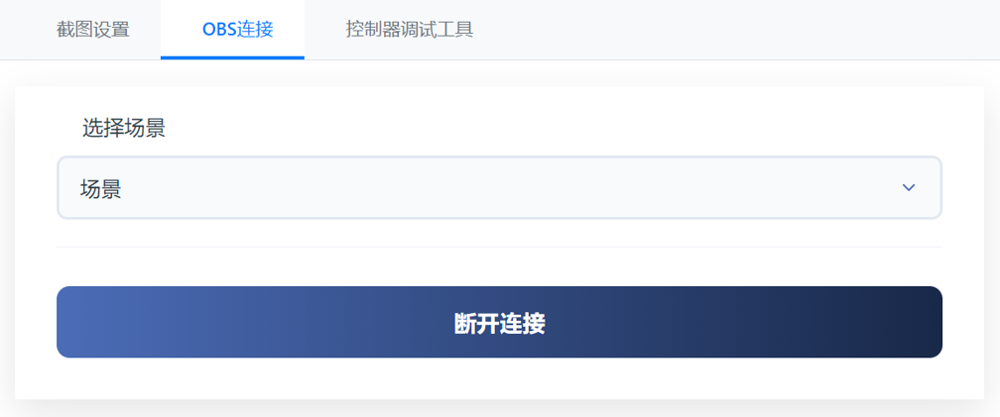

# 🎮 GamePad-ScreenShot

  <a href="README.md">简体中文</a> | <a href="README_EN.md">English</a>

  

  <strong>使用手柄快捷键进行全屏截图 或 OBS截图的工具</strong>

  
    
  

---

## 📖 简介

一个允许你使用**手柄按钮(Button)组合**或**轴值(Axis)**来触发**全屏截图**、**窗口截图** 或者 **OBS 截图** 的程序。

- ✅ 组合键 / 轴值(Axis)触发
- ✅ 保存文件名自定义
- ✅ 截图保存至剪切板
- ✅ 截图音频播放
- ✅ 对接**OBS-Websocket**，使用**OBS场景**来截图
- ✅ OBS模式下长按截图，保存回放缓存视频
- ✅ 多屏幕环境下可选择特定屏幕截图
- ✅ 支持窗口截图

---

## 🖼️ 软件界面

  

#### 🖼️ 覆层通知

  

---

## 🎮 如何设置组合按键

> 现已支持使用**轴值（Axis）**作为触发，DPad上下左右、R2/L2 等轴值均可配置为触发按键
>
1. 截图设置中【组合按钮】里的选项含义，可通过调试工具查看是哪一个Button。

  

---
## ⚙️ 通过OBS截图
1. 在 OBS 软件中手动开启 **WebSocket 服务器**（通常在“工具”菜单下）。
2. 打开本软件的 **OBS 连接设置** 页面。
3. 准确填写 OBS 服务器的 **IP 地址**、**端口号**及**密码**。
4. 点击连接服务

  

5. 在下拉列表中选择你想要抓取的 **场景 (Scene)**

  

6. 返回软件的 **截图设置** 页面，将“截图方式”切换为 **OBS** 即可生效。