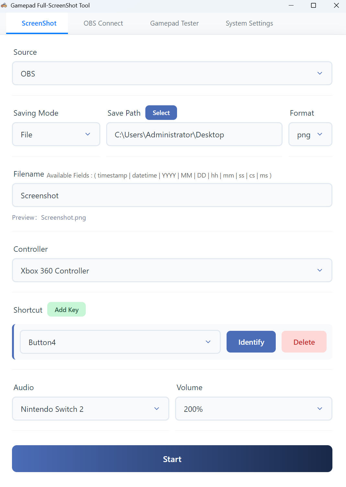
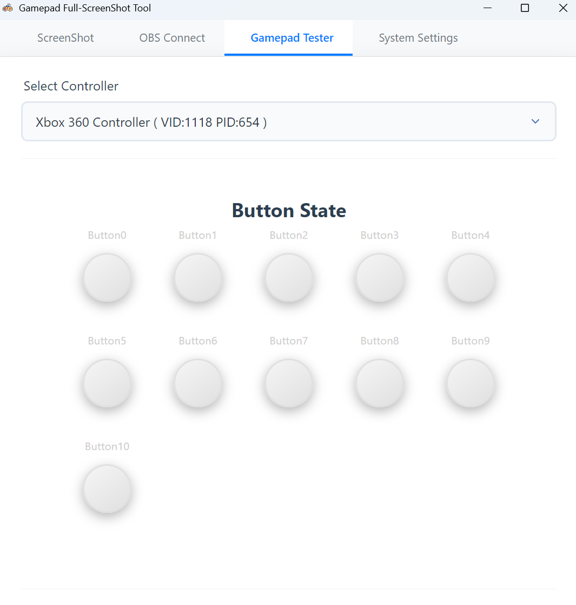
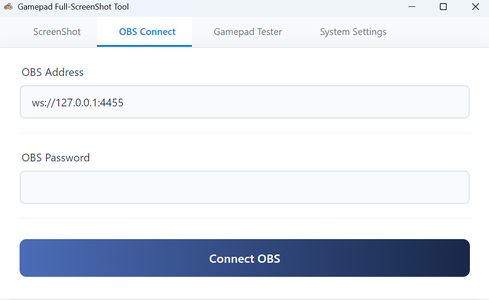
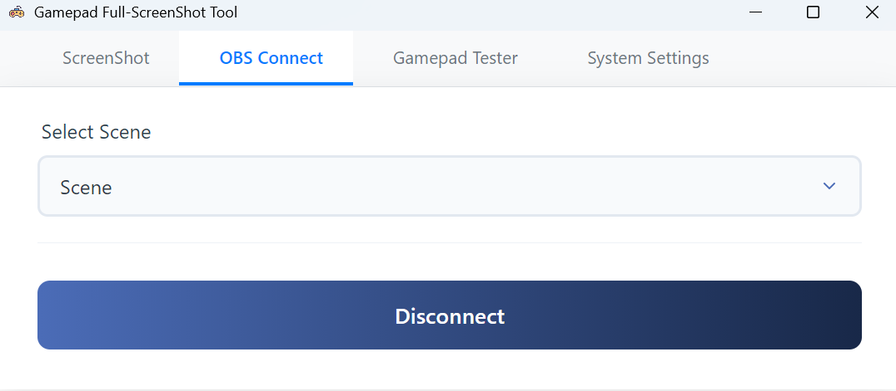

# 🎮 GamePad-ScreenShot

  <a href="README.md">简体中文</a> | <a href="README_EN.md">English</a>

  

  <strong>A tool to take full-screen or OBS screenshots using gamepad buttons</strong>

  
  
  

---

## 📖 Introduction

A utility that allows you to trigger **Full-screen screenshots** or **OBS screenshots** using **Gamepad button combinations**.

- ✅ Trigger via button combinations
- ✅ Customizable save filenames
- ✅ Save screenshots to clipboard
- ✅ Screenshot sound effects
- ✅ **OBS-Websocket** integration to capture specific **OBS Scenes**

---

## 🖼️ Interface

  

---

## 🎮 How to Set Up Button Combinations

> **Note:** Typically, D-Pad (Up/Down/Left/Right) and triggers (L2/R2) are treated as **Axis** inputs rather than digital buttons, so they cannot currently be used as trigger buttons.

1. You can verify which button corresponds to the options in the "Button Combination" settings by using the built-in debugging tool.

  

---

## ⚙️ Capturing via OBS

1. Manually enable the **WebSocket Server** within OBS (usually found under the "Tools" menu).
2. Open the **OBS Connection Settings** page in this software.
3. Enter the OBS Server **IP Address**, **Port**, and **Password**.
4. Click **Connect Service**.

  

5. Select the **Scene** you wish to capture from the dropdown list.

  

6. Return to the **Screenshot Settings** page and switch the "Capture Method" to **OBS**.

---

## 📋 TODO

- [x] Migrated from HID to **SDL2** for better controller compatibility
- [x] Integrated **OBS Socket service** for OBS-based captures
- [x] Audio volume adjustment
- [x] Selectable JPG/PNG formats
- [x] Customizable filenames
- [x] Copy to clipboard functionality
- [x] Multi-language support
- [ ] Add "Focused Window Title" as a custom field for file naming
- [ ] Auto-start with Windows and auto-start listener on launch
- [ ] Call Xbox Game Bar (Researching)

---

## ⚠️ Known Limitations

**The following limitations can be bypassed by using the OBS capture method:**

- Lack of support for non-16:9 aspect ratios.
- Unable to select specific monitors in multi-screen setups.
- Supports full-screen capture only; window-specific capture is not supported.

---